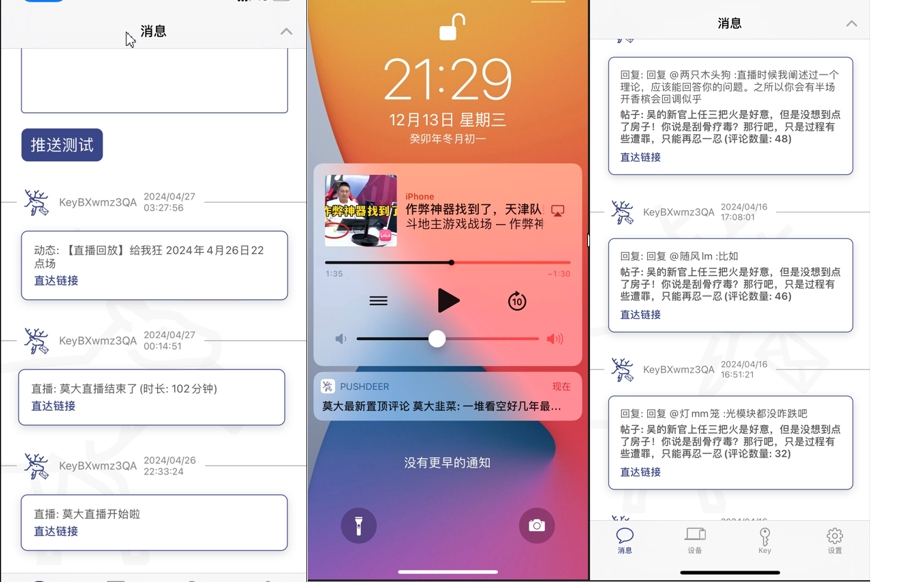

# pushdeer

个人推送通知,目前win服务器IIS已稳定运行几个月

## 技术

- 基于[PushDeer](https://www.pushdeer.com/),进行推送(ios食用最佳)

## 目前实现

### B 站

- [x] 个人动态
- [x] 个人动态置顶
- [x] 个人置顶动态回复
- [x] 直播动态
- [ ] 动态回复

#### 效果图
- 

### 其它 app

- [ ] 进行收集

## 问题

- 在 issus 留言
### 已知问题
1. bilibili cookie 必须用 js的 decodeURIComponent解码一下才行
